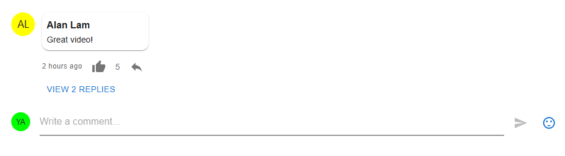
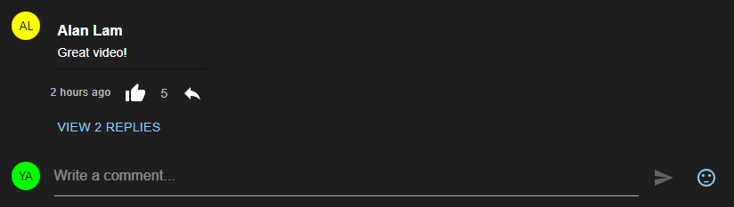
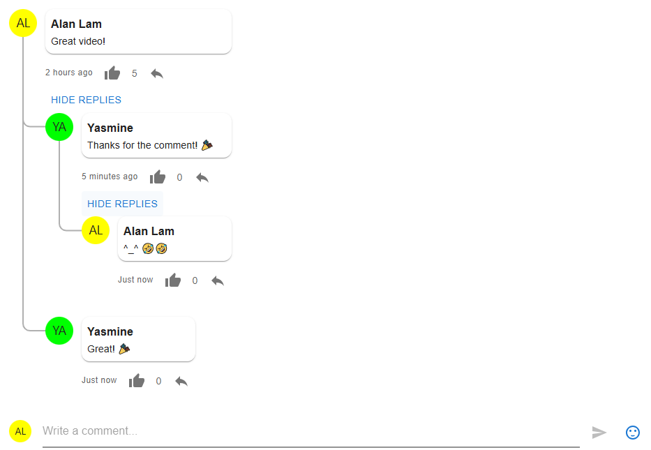

# react-comments-mui

A modern, customizable comment section component for React using Material-UI (MUI). Perfect for YouTube-style comment sections with nested replies, like/dislike functionality, and relative timestamps.

## Installation

### Prerequisites

Before installing `react-comments-mui`, make sure you have the required peer dependencies installed:

```bash
npm install react react-dom @mui/material @mui/icons-material @emotion/react @emotion/styled emoji-picker-react
```

### Install the Plugin

```bash
npm install react-comments-mui
```

---

## Showcase

- **Default Light Theme** - Standard appearance with light background

- **Dark Theme** - Dark mode support with custom colors

- **Nested Replies** - Threading system with collapsible replies


---

## Quick Start

```tsx
import React, { useState } from 'react';
import { ThemeProvider, createTheme } from '@mui/material/styles';
import { CommentSection } from 'react-comments-mui';

const theme = createTheme();

export const App = () => {
  const currentUser = {
    id: '1',
    username: 'Alan Lam',
    avatarUrl: 'https://ui-avatars.com/api/name=Alan&background=FFFF00'
  }

  const [comments, setComments] = useState([
    {
      id: '1',
      username: 'John Doe',
      avatarUrl: 'https://ui-avatars.com/api/name=John&background=random',
      timestamp: new Date(Date.now() - 2 * 60 * 60 * 1000),
      text: 'Great video!',
      likes: 5,
      dislikes: 1,
      currentUserLiked: false,
      currentUserDisliked: false,
      replies: [],
    },
  ]);

  const handleSubmit = (newComment: { text: string }, parentId?: string) => {
    const comment = {
      ...currentUser,
      timestamp: new Date(),
      text: newComment.text,
      likes: 0,
      dislikes: 0,
      currentUserLiked: false,
      currentUserDisliked: false,
      replies: [],
    };

    if (parentId) {
      const addReply = (comments: any[]): any[] =>
        comments.map((c) => ({
          ...c,
          replies: c.id === parentId ? [...c.replies, comment] : addReply(c.replies),
        }));
      setComments(addReply(comments));
    } else {
      setComments([...comments, comment]);
    }
  };

  const handleLike = (id: string) => {
    const toggleLike = (comments: any[]): any[] =>
      comments.map((c) => ({
        ...c,
        likes: c.id === id ? (c.currentUserLiked ? c.likes - 1 : c.likes + 1) : c.likes,
        currentUserLiked: c.id === id ? !c.currentUserLiked : c.currentUserLiked,
        replies: toggleLike(c.replies),
      }));
    setComments(toggleLike(comments));
  };

  return (
    <ThemeProvider theme={theme}>
      <CommentSection
        comments={comments}
        onSubmit={handleSubmit}
        onLike={handleLike}
        currentUser={{ username: currentUser.username, avatarUrl: currentUser.avatarUrl }}
        hasMore={false}
      />
    </ThemeProvider>
  );
};
```

---

## Props Documentation

### `CommentSection` Component

The main component that renders the comment section.

| Prop | Type | Required | Description |
|------|------|----------|-------------|
| `comments` | `Comment[]` | Yes | Array of comment objects to display. Each comment can have nested replies. |
| `onSubmit` | `(newComment: { text: string }, parentId?: string) => void` | Yes | Callback triggered when user submits a comment. If `parentId` is provided, it's a reply to that comment. |
| `onLike` | `(commentId: string) => void` | Yes | Callback triggered when user clicks the like button on a comment. |
| `currentUser` | `User \| null` | Yes | Current logged-in user object. Set to `null` to disable the comment form. |
| `hasMore` | `boolean` | No | Whether there are more comments to load. Shows a "Load More" button if true. (default: `false`) |
| `loadMore` | `() => void` | No | Callback to load more comments. Called when user clicks the "Load More" button. |

### Data Structures

#### `Comment` Type

```typescript
interface Comment {
  id: string;                      // Unique identifier for the comment
  username: string;                // Username of the commenter
  avatarUrl?: string;              // Avatar image URL
  timestamp: Date;                 // When the comment was posted (Date object)
  text: string;                    // Comment text content
  likes: number;                   // Number of likes
  dislikes: number;                // Number of dislikes
  currentUserLiked: boolean;        // Whether current user liked this comment
  currentUserDisliked: boolean;     // Whether current user disliked this comment
  replies: Comment[];              // Nested replies (same structure as Comment)
}
```

#### `User` Type

```typescript
interface User {
  username: string;               // Username to display
  avatarUrl?: string;             // User's avatar image URL
}
```

---

## Theme Customization

### Default Theme

The plugin comes with a sensible default theme. Simply wrap your component with MUI's `ThemeProvider`:

```tsx
import { ThemeProvider, createTheme } from '@mui/material/styles';
import { CommentSection } from 'react-comments-mui';

const theme = createTheme();

<ThemeProvider theme={theme}>
  <CommentSection {...props} />
</ThemeProvider>
```

### Using the `createCommentTheme` Helper

For advanced customization, use the `createCommentTheme()` function:

```tsx
import { createCommentTheme } from 'react-comments-mui';
import { ThemeProvider } from '@mui/material/styles';

const theme = createCommentTheme({
  reactCommentsMui: {
    containerBackgroundColor: '#ffffff',
    containerMaxWidth: '1000px',
    avatarSize: 40,
    cardBorderRadius: 12,
  },
  palette: {
    primary: {
      main: '#1976d2',
    },
  },
});

<ThemeProvider theme={theme}>
  <CommentSection {...props} />
</ThemeProvider>
```

### Customizable Theme Properties

The `reactCommentsMui` object supports the following customizable properties:

| Property | Type | Default | Description |
|----------|------|---------|-------------|
| `containerBackgroundColor` | string | `'#f9f9f9'` | Background color of the comment section container |
| `containerMaxWidth` | string \| number | `'800px'` | Maximum width of the comment section container |
| `avatarSize` | number | `32` | Size of user avatars in pixels |
| `cardBorderRadius` | number | `8` | Border radius of comment cards in pixels |

### Theme Customization Examples

#### Dark Theme

```tsx
const darkTheme = createCommentTheme({
  palette: {
    mode: 'dark',
  },
  reactCommentsMui: {
    containerBackgroundColor: '#1e1e1e',
  },
});
```

#### Large Avatars & More Rounded Cards

```tsx
const largeTheme = createCommentTheme({
  reactCommentsMui: {
    avatarSize: 50,
    cardBorderRadius: 16,
    containerMaxWidth: '1200px',
  },
});
```

#### Custom Brand Colors

```tsx
const brandedTheme = createCommentTheme({
  palette: {
    primary: {
      main: '#ff6b6b',
    },
    secondary: {
      main: '#4ecdc4',
    },
  },
  reactCommentsMui: {
    containerBackgroundColor: '#f8f9fa',
    cardBorderRadius: 12,
  },
});
```

---

## TypeScript Support

This plugin is fully typed with TypeScript. All components and types are properly exported:

```tsx
import { 
  CommentSection, 
  Comment, 
  User,
  createCommentTheme,
  defaultCommentTheme 
} from 'react-comments-mui';
```

---

## Key Features Explained

### Relative Timestamps

Comments automatically display user-friendly relative times:
- "Just now" - for comments posted less than a minute ago
- "5 minutes ago", "2 hours ago", etc.
- Timestamps are calculated from the `Date` object passed to each comment

### Nested Replies

The plugin supports unlimited reply nesting:
- Click the "Reply" button to start composing a reply
- Replies can be collapsed/expanded with the "View X replies" button
- Perfect for threaded discussions

### Like/Dislike System

Each comment maintains vote counts:
- `likes` and `dislikes` show the current vote counts
- `currentUserLiked` and `currentUserDisliked` flags highlight the user's vote
- Clicking the buttons toggles the vote state via the `onLike` callbacks

### Emoji Picker

The comment form includes an integrated emoji picker:
- Click the smiley icon to open the picker
- Select any emoji to insert it into your comment
- Works seamlessly with the text input

---


## License

MIT - Feel free to use in personal and commercial projects

## Contributing

Contributions are welcome! Feel free to submit a Pull Request or open an issue.

## Support

For issues, questions, or feature requests:
- Open an issue on [GitHub](https://github.com/winglunlam/react-comments-mui)
---
